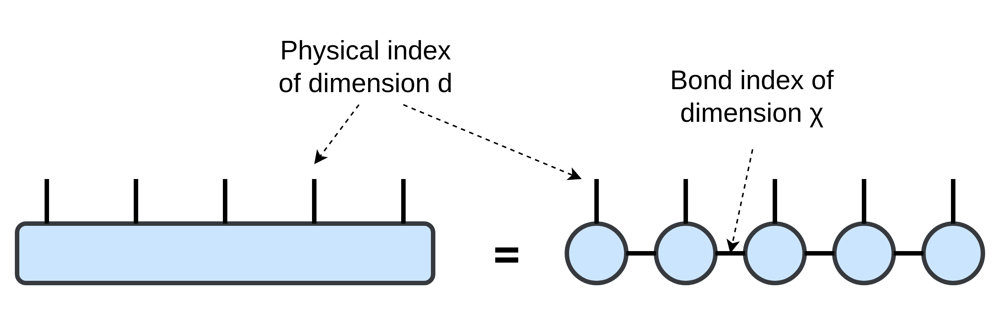

# The MPS representation of a state
As opposed to state vector solvers (of the Master/Schrödinger equation), tensor network based approaches use adaptive data structures, which in the case of _EMU-MPS_ are called [matrix product state/operator (MPS/MPO)](http://tensornetwork.org/mps/). They are adaptive in the sense that the memory used to store such a state/operator does not only depend on the dimension of the state space, but also on the specific state you're trying to represent. In many relevant use cases, this makes representation more memory-efficient, which allows pushing for higher number of qubits compared to state vector solvers. However, it has the drawback that the cost of the simulation is less predictable since there is no _a priori_ method to know how much information is going to be relevant at the next step of the solver. The are configurable hard caps on memory consumption built into _EMU-MPS_ ([see here](../memory.md)), but when these are hit it becomes necessary to check for validity of the results ([see here](../convergence.md)).

The take-home message is that a reasonable way to assess _EMU-MPS_ performance is by __benchmarking relevant and meaningful sequences/use-cases__ ([see here](../../benchmarks/index.md)).

## Bond dimension
Please, have a look at [http://tensornetwork.org/mps/](http://tensornetwork.org/mps/) for a more general introduction to matrix product states.

The MPS is the best understood factorization of an arbitrary tensor, for which many efficient algorithms have been developed. For a quick understanding, in tensor diagram notation, let's consider the wavefunction of $N$ qubits:

Alternatively, the MPS of the state can be expressed in traditional notation as

$$
|s_1 s_2\dots s_N\rangle = \sum_{\{\alpha\}}A^{s_1}_{\alpha_1}A^{s_2}_{\alpha_1\alpha_2}\dots A^{s_N}_{\alpha_N}
$$

The state is therefore is represented as a product of tensors. The contracted (or summed over) indices $\{\alpha\}$ are called __bond indices__ and their dimension (the bond dimension) can vary from bond to bond.

__The bond dimension required to perfectly represent a state depends on its entanglement (roughly, how much quantum information is stored in it). Up to this limit, a higher bond dimension will mean that the state is represented more faithfully. However, a higher bond dimension also implies that size of the state will be bigger, thus making the emulation more expensive.__

As a consequence, the real power of the MPS representation is that the bond dimension, $\chi= dim(\alpha)$, gives us an additional knob to control how much information about the state we want to capture. Many relevant states can already be represented faithfully using less memory than a state vector, but by restricting $\chi$ further, additional memory savings are possible, potentially without loss of simulation quality ([see here](../convergence.md)).

## Truncation of the state

After each 2-site evolution ([see here](../tdvp.md)), an SvD is applied to split the state vector for the 2-site subsystem back into two tensors for the MPS. The number of singular values give the dimension of the bond connecting the 2 qubits in the MPS. To keep the memory consumption of the state in check, the set of singular values is truncated as per the `precision` and `max_bond_dim` arguments in the [config](../config.md).

Of these two parameters, `precision` is the most physically relevant. Whenever truncation occurs, the smallest singular values are thrown away until doing so would increase the norm distance between the original and truncated states above `precision`. Notice that this does not give any guarantees on the state size after truncation. However, for a given `precision`, clear bounds can be given on the truncation error incurred by the simulation ([see here](../errors.md)) in terms of norm distance. This in turn can be used to derive upper bounds on the error incurred in various observables outputted by the simulation.

The `max_bond_dim` argument, on the other hand gives strong memory consumption guaranteed. Whenever truncation occurs, the smallest singular values are thrown away until at most `max_bond_dim` values remain, even if this would cause the norm distance between the original and truncated states to exceed the `precision`. This means the `max_bond_dim` takes precedence over `precision` and imposes a hard cap on the memory consumption of the program. Since all the matrices involved in the simulation are also constrained in size, lowering `max_bond_dim` also benefits the runtime fo a simulation. The drawback is that the error cannot be estimated anymore a priori, so when the `max_bond_dim` is hit by the simulation, extra care needs to be taken that the simulation results are still accurate.
