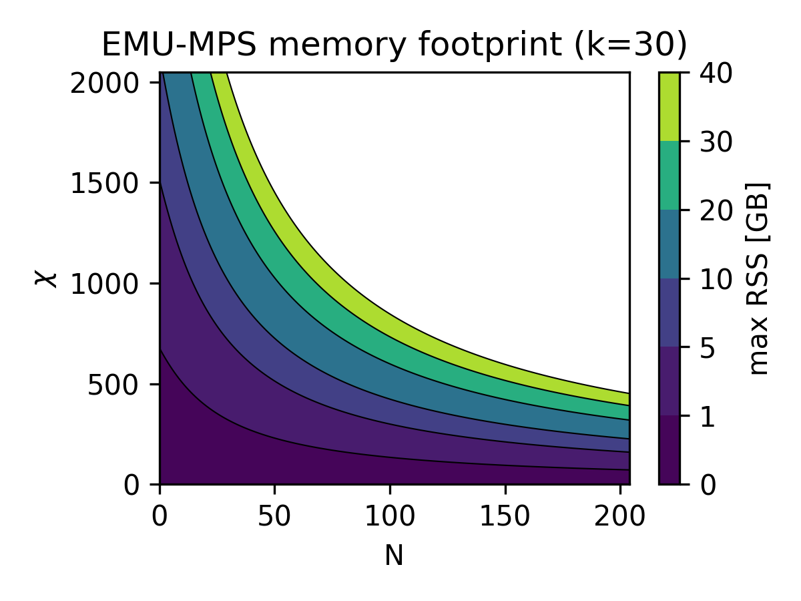

# EMU-MPS benchmarks

All the benchmarks are run on a single NVIDIA A100 GPU of Pasqal's DGX-cluster and for best performance on heavy workloads we recommend using such setup.
There, users should expect _EMU-MPS_ to emulate up to

- 30 atoms for **quenches**
- 50 atoms for **adiabatic sequences**

for 2D systems and for realistic pulse sequences (~μs) that can be run on the QPU.
For these relevant hard use-cases (described below) the bond dimension is let to grow free to achieve the desired precision.

In all other scenarios, for specific combinations of number of qubits $N$ and bond dimension $\chi$,
the resources need to emulate a sequence **can be estimated** by:

- RSS: the resident set size, i.e. the maximum needed memory
- $\langle\Delta t\rangle$: GPU time to do a single step in the time evolution

These quantities are represented in the following plots:




The RSS plot (left) shows the memory cost of the emulation.
It is expected to stay constant at fixed bond dimension and thus represent the total memory occupation of the emulation of a sequence.
As evident, the emulator is mostly limited by the available memory (40 GB on NVIDIA A100), as it restricts the maximum number of qubits/bond dimension pair allowed.
To get the total estimated runtime instead, one should just simply multiply the time estimate in the timing plot (right) by the number of steps in the emulated sequence.

While the simple resources estimate provided above allows to upper bound the memory/time cost of an emulation, a final very important remark has to be made. If during an emulation, the bond dimension reach a user-set maximum value (with the `max_bond_dim` argument), the accuracy of the subsequent results of the time evolution cannot be guaranteed anymore, as discussed [here](../advanced/convergence.md).

Finally, it is an ongoing effort to improve performance by making _EMU-MPS_ distribute work to either optimize for runtime or memory profile.

## Use-case benchmarks


Benchmark efforts, documented here, are meant to provide insights for _EMU-MPS_ users about

- **Performance**: runtime, memory usage, bond dimension as a function of qubit number ([see here](../advanced/mps/index.md#bond-dimension))
- **Accuracy**: different precision levels as compared to state vector solvers

given a set of meaningful sequences of interest (quench, adiabatic and use-case sequences) that we are going to introduce case by case. Finally, we will only focus on 2d atomic registers as they represent the most numerically challenging and interesting case to study.

## Contents

The benchmarks are ordered in subpages by general topic.

- [Accuracy](./accuracy.md)
- [Performance](./performance.md)
- [Noise](./noise.md)

The accuracy benchmarks compare results between emulators to engender confidence in the results _EMU-MPS_ generates. The performance benchmarks exist to exhibit the runtime and memory consumption characteristics of _EMU-MPS_. Based on these, the reader should get a feel for what kind of parameters would be required to be able to run a given sequence in a given time. Note that this is independent of whether the emulation results are actually accurate ([see here](../advanced/convergence.md)). Finally, the noise page presents benchmarks regarding noisy simulations, focusing on effects specific to noise that are not already covered in the other pages.

## Sequences used

- __Adiabatic evolution:__ Here at each time step, the evolution of the driving $\Omega, \Delta$ is _slow enough_ to guarantee that the evolved state is still an equilibrium state of $H$. Note that the adiabaticity of a sequence is dependent on the energy gaps in the Hamiltonian, and since these gaps decrease with qubit number, most sequences are only adiabatic up to a given qubit number.

```python
# from https://pulser.readthedocs.io/en/stable/tutorials/afm_prep.html
# parameters in rad/µs and ns
Omega_max = 2.0 * 2 * np.pi
U = Omega_max / 2.0
delta_0 = -6 * U
delta_f = 2 * U
t_rise = 500
t_fall = 1000
t_sweep = (delta_f - delta_0) / (2 * np.pi * 10) * 3000
R_interatomic = MockDevice.rydberg_blockade_radius(U)
reg = Register.rectangle(rows, columns, R_interatomic, prefix="q")
if perm_map:
    reg_coords = reg._coords
    reg = Register.from_coordinates([reg_coords[i] for i in perm_map])
rise = Pulse.ConstantDetuning(RampWaveform(t_rise, 0.0, Omega_max), delta_0, 0.0)
sweep = Pulse.ConstantAmplitude(
    Omega_max, RampWaveform(t_sweep, delta_0, delta_f), 0.0
)
fall = Pulse.ConstantDetuning(RampWaveform(t_fall, Omega_max, 0.0), delta_f, 0.0)
seq = Sequence(reg, MockDevice)
seq.declare_channel("ising", "rydberg_global")
seq.add(rise, "ising")
seq.add(sweep, "ising")
seq.add(fall, "ising")
```

- __Quench:__ One of the most fundamental protocols to drive a system out of equilibrium, it is realized here as follows: at time $t=0$ the system is prepared in the ground state $|\psi_0\rangle$ of $H_0$. The driving field is then suddenly turned on ($\Omega\neq0$) and the system is evolved for $t > 0$, as $|\psi\rangle=e^{-iHt}|\psi_0\rangle$.

```python
hx = 1.5  # hx/J_max
hz = 0  # hz/J_max
t = 1.5  # t/J_max
# Set up Pulser simulations
R = 7  # microm
reg = Register.rectangle(nx, ny, R, prefix="q")
# Conversion from Rydberg Hamiltonian to Ising model
U = AnalogDevice.interaction_coeff / R**6  # U_ij
NN_coeff = U / 4
omega = 2 * hx * NN_coeff
delta = -2 * hz * NN_coeff + 2 * U
T = np.round(1000 * t / NN_coeff)
seq = Sequence(reg, MockDevice) #circumvent the register spacing constraints
seq.declare_channel("ising", "rydberg_global")
# Add the main pulse to the pulse sequence
simple_pulse = Pulse.ConstantPulse(T, omega, delta, 0)
seq.add(simple_pulse, "ising")
```

These two types of driving typically complement each other.
Since the matrix product state approach in _EMU-MPS_ strives to minimize the stored information, keeping track of a single equilibrium state in adiabatic time evolution is typically easier. While this single state can be a complicated object itself, quenches, driving the system out of equilibrium, involve taking into account multiple excited states, and are typically computationally harder to emulate.

## CPU/GPU hardware

_EMU-MPS_ is built on top of [pytorch](https://pytorch.org/). Thus, it can run on most available CPUs and GPUs, from a laptop to a cluster. The presented benchmarks are run on an NVIDIA DGX cluster node, requesting the following resources

- GPU: 1 NVIDIA A100 (40 GB)
- CPU: 16 cores on AMD EPYC 7742

Of course, performance will vary depending on the hardware.
For this reason, if at any point of your work, performance becomes critical, we always recommend to use Pasqal's DGX cluster.
If you intend to run _EMU-MPS_ on your laptop, for example, please be aware that the suggestion to use a GPU for heavier workloads might not be valid.
In such case it is always good to check performance on a couple of runs, changing the _EMU-MPS_ config default values as documented in the [API](../api.md#mpsconfig).
In particular `num_devices_to_use = 0` will run the emulation on CPU, while `num_devices_to_use ≥ 1` on GPU/s.
