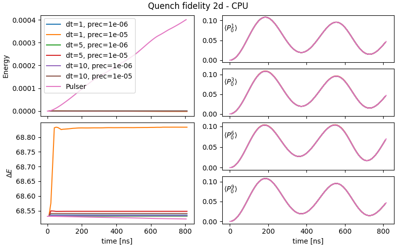
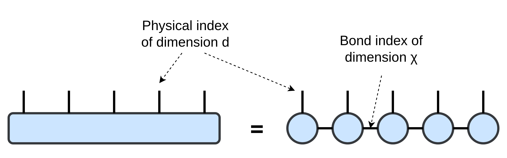

# emu-mps benchmarks

Users should expect _emu-mps_ to emulate the QPU for<sup>[[1]](#disclaimer)</sup>
- 2d systems up to 30 atoms for quenches and 50 adiabatic sequences
- Realistic sequences (~μs)

on Pasqal's DGX-cluster.
For best performance on heavy workloads, we recommend using a cluster GPU (NVIDIA A100).
At this point, the maximum number of atoms is mostly limited by available memory (40 GB). It is an ongoing effort to improve performance by making _emu-mps_ to distribute work among multiple GPUs (coming soon).

---

Benchmark efforts, as documented here, are meant to provide insights to _emu-mps_ users about the expected
- **Performance**: runtime, allocations, number of qubits, bond dimension<sup>[[2]](#bonddimension)</sup>
- **Accuracy**: different precision levels as compared to state vector solvers

given a set of meaningful sequences of interest (quench, adiabatic and use-case sequences) that we are going to introduce case by case. Finally, we will only focus on 2d atomic registers as they represent the most numerically challenging and interesting case to study.


- ### I. [Basic sequences](#i-basic-sequences)
    - [Performance](#ia-performance)
    - [Accuracy](#ib-accuracy)
- ### II. [Noise](#ii-noise) (coming soon)
- ### III. [Use cases](#iii-use-cases) (coming soon)

Feedbacks are more than welcome! If you are interested in the performance of any sequence, please, do not hesitate to get in touch with the Emulation team.


# I. Basic sequences
A first class of benchmarks covers the minimal meaningful pulse sequences that can be realistically run on the QPU:
- __Adiabatic time evolution:__ the evolution is _slow enough_ to guarantee that the evolved state is always an equilibrium state.
- __Quench:__ The system is strongly driven out of equilibrium

Both are interesting and they complement each other. Quenches, in particular, are typically computationally harder to emulate. For more details, please, have a look at insight [[3]](#qpu_h_and_seqs).

### I.a Performance

As anticipated, in the performance benchmarks, we will track several relevant metrics:
- __Bond dimension $\chi$:__ the maximum internal link dimension of the MPS representation of the time evolved state<sup>[[2]](#bonddimension)</sup>.
- __State size $|\psi|$:__ memory footprint of the state (in MB).
- __RSS:__ resident set size allocated by the emulation.
- $\Delta t$: CPU/GPU time to complete a time step.

#### Adiabatic sequence

We run an adiabatic sequence to make an antiferromagnetic (AFM) state, as taken from [Pulser documentation](https://pulser.readthedocs.io/en/stable/tutorials/afm_prep.html), alongside the biggest register:

[put the pulser seq and register here]

Performance metrics, for the defined sequence and for the biggest register are shown below, in the left column of the figures, for CPU and GPU workloads.
From the plots it is easy to understand that all the metrics heavily correlate with each other. Specifically a higher bond dimension will translate in higher memory footprint and runtimes<sup>[[2]](#bonddimension)</sup>.


In the right column (both CPU and GPU figure), we explore the available register size. Simply increasing the number of atoms by $N=N_x\times N_y$, and extracting the maximum metric and the total runtime for each run, the user can get a feeling on how much memory and time a specific sequence is going to take to emulate.

#### Quench

Here, we explore performance in the very same way as before, but for the quench sequence:

[TODO: Put the Pulser seq and register here]

The overall metrics, as before, both for a single run (left) and for multiple runs varying the register size (right, $N=N_x\times N_y$) are presented below:


As expected<sup>[[3]](#qpu_h_and_seqs)</sup>, the quench requires significantly more memory to run compared to the adiabatic sequence.

#### Qubit shuffling

A seemingly innocuous operation like reordering the register labels can actually affect the performance, as a consequence of the MPS representation<sup>[[2]](#bonddimension)</sup>. In simple terms, the additional memory cost, and thus performance, comes from representing for example two strongly interacting atoms, in two far apart tensors in the MPS, since all the intermediate tensors in the chain have to somehow pass that information between them.

To be more quantitative, in the following benchmark case, we run the same AFM sequence from before, but shuffling the qubit labeling order.

[TODO: put the two registers here]


[TODO: fix this plot]

The left column of the image shows no accuracy degradation from the qubit shuffling, returning equivalent observables. That is expected since both runs were able to converge to the desired precision.

However, performance metrics (allocations and runtime) of the shuffled case significantly worsen.

In the future we plan to apply register ordering strategies by default, but for the moment, the take-home message is that a good register embedding is important. Ideally, one should keep strongly interactive pairs or atoms the closest possible when enumerating them in the register.

### I.b Accuracy

Here we discuss the emulator accuracy, as compared to Pulser state vector solver backend (qutip), but in the future might directly compare QPU results.
Accuracy, here, specifically refer to observables:
- __Energy:__ $E = \langle\psi|H|\psi\rangle$
- __Energy variance:__ $\Delta E = \langle\psi|H^2|\psi\rangle-E^2$
- __Magnetization:__ $P_{r}^j = |\langle r^j|\psi\rangle|^2$

The emulated sequences are going to be the same as before, an adiabatic and a quench. We will check accuracy against two main tunable parameters in _emu-mps_:
- `precision`<sup>[[4]](#timestepprecision)</sup>: at each step, throw away components of the state whose sum weighs less that the specified precision.
- time step `dt`: sampling time of the sequence.




Both sequences are emulated multiple times by varying the both precision and time step.
- [TODO: better plots to discuss better the precision role.]
- Decreasing the time step it is only useful for high precision and very rapidly changing pulses.

[TODO: For a more in depth discussion change the plots to have the observables on the left column and difference respect to Pulser state vector on right column]

# II. Noise
Coming soon...

# III. Use cases
Coming soon...

# Insights
<details>
<summary>[1] Performance will depend several factors <a name="disclaimer"></a></summary>
<blockquote>

<b>a. Matrix product representation</b>

As opposed to state vector solvers (of Master/Schrödinger equation), tensor network based approaches use adaptive data structures, which in the case of _emu-mps_ are called [matrix product state/operators (MPS/MPO)](http://tensornetwork.org/mps/). In many relevant use cases, this makes representation more memory-efficient, which allows pushing for higher number of qubits compared to state vector solvers. However, it has the drawback to make the cost of the simulation less predictable since there is no _a priori_ method to know how much information is going to be relevant at the next step of the solver.

The take-home message is that a reasonable way to assess _emu-mps_ performance is by __benchmarking relevant and meaningful sequences/use-cases__.

----

<b>b. QPU hardware</b>

Different devices can have different $C_6$ coefficients and support for different maximum driving amplitudes $\Omega$ [ref to Hamiltonian here].
Intuitively, under stronger interactions (rydberg-rydberg and laser-rydberg),
bond dimension will grow more quickly<sup>[[2]](#bonddimension)</sup>, thus affecting performance of our tensor network based emulator.
For a list of the available devices and their specifications, please refer to [Pulser documentation](https://pulser.readthedocs.io/en/stable/tutorials/virtual_devices.html).

----

<b>c. CPU/GPU hardware</b>

_emu-mps_ is built on top of [pytorch](https://pytorch.org/). Thus, it can run on most available CPUs and GPUs, from a laptop to a cluster. The presented benchmarks are run on an NVIDIA DGX cluster node, requesting the following resources
- GPU: 1 NVIDIA A100 (40 GB)
- CPU: 16 cores on AMD EPYC 7742

Of course, performance will vary depending on the hardware.
For this reason, if at any point of your work, performance becomes critical, we always recommend to use Pasqal's DGX cluster.
If you intend to run _emu-mps_ on your laptop, for example, please be aware that the suggestion to use a GPU for heavier workloads might not be valid.
In such case it is always good to check performance on a couple of runs, changing the _emu-mps_ config default values of the time step `dt`, `precision`, `max_bond_dim` and `num_devices_to_use`:
```
MPSConfig(
    ...
    dt: int = 10,
    precision: float = 1e-5,
    max_bond_dim: int = 1024,
    num_devices_to_use: int = torch.cuda.device_count(),
    ...
    )
```
In particular `num_devices_to_use = 0` will run the emulation on CPU, while `num_devices_to_use ≥ 1` on GPU/s.
</blockquote>
</details>


<details>
<summary>[2] Bond dimension <a name="bonddimension"></a></summary>
<blockquote>
Please, have a look at [http://tensornetwork.org/mps/](http://tensornetwork.org/mps/) for a more general introduction to matrix product states.

The MPS is the best understood factorization of an arbitrary tensor, for which many efficient algorithms have been developed. For a quick understanding, in tensor diagram notation, let's consider the wavefunction of $N$ qubits:



Alternatively, the MPS of the state can be expressed in traditional notation as

$$
|s_1 s_2\dots s_N\rangle = \sum_{\{\alpha\}}A^{s_1}_{\alpha_1}A^{s_2}_{\alpha_1\alpha_2}\dots A^{s_N}_{\alpha_N}
$$

The state is therefore is represented as a product of tensors. The contracted (or summed over) indices $\{\alpha\}$ are called __bond indices__ and their dimension (the bond dimension) can vary from bond to bond.

__The bond dimension required to perfectly represent a state depends on its entanglement (roughly, how much quantum information is stored in it). Up to this limit, a higher bond dimension will mean that the state is represented more faithfully. However, a higher bond dimension also implies that size of the state will be bigger, thus making the emulation more expensive.__

As a consequence, the real power of the MPS representation is that the bond dimension, $\chi= dim(\alpha)$, gives us an additional knob to control how much relevant information about the state we want to capture, potentially making it a more efficient representation compared to the state vector one.

The most physically-relevant way to do it in _emu-mps_ is by specifying the `precision` argument during the time evolution. Doing so, at each step, will throw away components of the state whose sum weighs less that the specified precision, achieving a smaller bond dimension and therefore reducing the memory footprint of the state.

As an additional feature, _emu-mps_ also allows to conveniently fix the maximum bond dimension allowed, by specifying the `max_bond_dim` argument. Intuitively, the truncation algorithm will select the `max_bond_dim` most relevant components of the state. The drawback is that the error cannot be estimated anymore a priori.
</blockquote>
</details>


<details>
<summary>[3] QPU Hamiltonian & basic sequences <a name="qpu_h_and_seqs"></a></summary>
<blockquote>
In all cases we will refer to $H$ as the rydberg-rydberg Hamiltonian that can be implemented on Pasqal's hardware,

$$
H = -\sum_j\Delta_jn_j \ + \ \sum_j\Omega_j\sigma^x_j \ + \ H_{rr}
$$

where the interaction Hamiltonian reads

$$
H_{rr} = \sum_{i>j}\frac{C_{6}}{r_{ij}^{6}} n_{i}n_{j}
$$

Values of $\Omega_j$ and $\Delta_j$ respectively represent the amplitude and the detuning the driving field applied to the qubit $j$. Avoiding technical details we will refer to eigenstates of $H$ (and in particular to the ground state) as equilibrium states.

We then explore two time evolution protocols:
- __Adiabatic evolution:__ Here at each time step, the evolution of the driving $\Omega, \Delta$ is _slow enough_ to guarantee that the evolved state is still an equilibrium state of $H$.
- __Quench:__ One of the most fundamental protocols to drive a system out of equilibrium, it is realized here as follows: at time $t=0$ the system is prepared in the ground state $|\psi_0\rangle$ of $H_0$. The driving field is then suddenly turned on ($\Omega\neq0$) and the system is evolved for $t > 0$, as $|\psi\rangle=e^{-iHt}|\psi_0\rangle$.

As anticipated, they typically complement each other.
Since the matrix product state approach in _emu-mps_ strives to minimize the stored information, keeping track of a single equilibrium state in adiabatic time evolution is typically easier. While this single state can be a complicated object itself, quenches, driving the system out of equilibrium, involves taking into account multiple excited states, thus (again, typically as a rule of thumb), computationally harder to emulate.

</blockquote>
</details>
