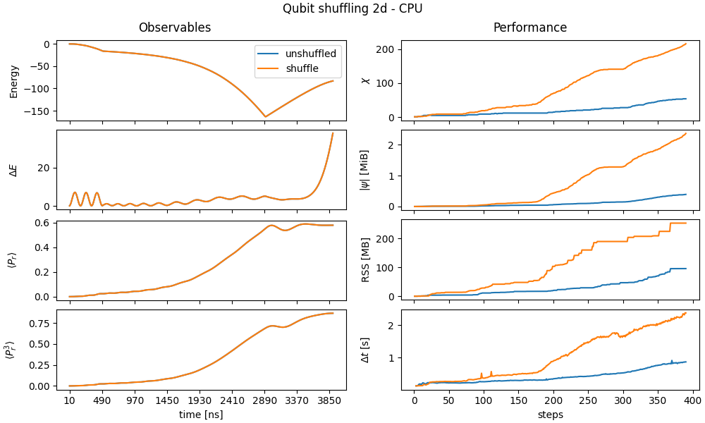

# EMU-MPS benchmarks

Users should expect _Emu-MPS_ to emulate the QPU for<sup>[[1]](#performance)</sup>
- 2d systems up to 30 atoms for quenches and 50 adiabatic sequences
- Realistic sequences (~μs)

on Pasqal's DGX-cluster.
Although _EMU-MPS_ should run on most common hardware configurations (with or without gpu), for best performance on heavy workloads we recommend using a cluster GPU (NVIDIA A100).
The emulator is mostly limited by the available memory (40 GB on an NVIDIA A100), as it limits the maximum number of qubits and the pulse duration that can be simulated. It is an ongoing effort to improve performance by making _EMU-MPS_ distribute work to either optimize for runtime or memory profile.

---

Benchmark efforts, as documented here, are meant to provide insights for _EMU-MPS_ users about

- **Performance**: runtime, memory usage, bond dimension as a function of qubit number ([see here](../advanced/mps/index.md#bond-dimension))
- **Accuracy**: different precision levels as compared to state vector solvers

given a set of meaningful sequences of interest (quench, adiabatic and use-case sequences) that we are going to introduce case by case. Finally, we will only focus on 2d atomic registers as they represent the most numerically challenging and interesting case to study.


- ### I. [Basic sequences](#i-basic-sequences)
    - [Performance](#ia-performance)
    - [Accuracy](#ib-accuracy)
- ### II. [Noise](#ii-noise) (coming soon)
- ### III. [Use cases](#iii-use-cases) (coming soon)

Feedbacks are more than welcome! If you are interested in the performance of any sequence, please, do not hesitate to get in touch with the Emulation team.

# I. Basic sequences
A first class of benchmarks covers the minimal meaningful pulse sequences that can be realistically run on the QPU:

- __Adiabatic evolution:__ Here at each time step, the evolution of the driving $\Omega, \Delta$ is _slow enough_ to guarantee that the evolved state is still an equilibrium state of $H$.
- __Quench:__ One of the most fundamental protocols to drive a system out of equilibrium, it is realized here as follows: at time $t=0$ the system is prepared in the ground state $|\psi_0\rangle$ of $H_0$. The driving field is then suddenly turned on ($\Omega\neq0$) and the system is evolved for $t > 0$, as $|\psi\rangle=e^{-iHt}|\psi_0\rangle$.

These two types of driving typically complement each other.
Since the matrix product state approach in _Emu-MPS_ strives to minimize the stored information, keeping track of a single equilibrium state in adiabatic time evolution is typically easier. While this single state can be a complicated object itself, quenches, driving the system out of equilibrium, involve taking into account multiple excited states, and are typically computationally harder to emulate.

### I.a Performance

As outlined above, in the performance benchmarks, we will track several relevant metrics associated with runtime, memory usage and bond dimension:

- __Bond dimension $\chi$:__ the maximum internal link dimension of the MPS representation of the time evolved state ([see here](../advanced/mps/index.md#bond-dimension)).
- __State size $|\psi|$:__ memory footprint of the state (in MB).
- __RSS:__ peak memory allocated by the emulation.
- $\Delta t$: CPU/GPU time to complete a time step.

We will give information about these metrics for various values of __N__, the qubit number, to give an idea of how performance scales.

#### Adiabatic sequence

We run an adiabatic sequence to make an antiferromagnetic (AFM) state, as taken from [Pulser documentation](https://pulser.readthedocs.io/en/stable/tutorials/afm_prep.html), alongside the biggest register:

```python
# from https://pulser.readthedocs.io/en/stable/tutorials/afm_prep.html
# parameters in rad/µs and ns
Omega_max = 2.0 * 2 * np.pi
U = Omega_max / 2.0
delta_0 = -6 * U
delta_f = 2 * U
t_rise = 500
t_fall = 1000
t_sweep = (delta_f - delta_0) / (2 * np.pi * 10) * 3000
R_interatomic = MockDevice.rydberg_blockade_radius(U)
reg = Register.rectangle(rows, columns, R_interatomic, prefix="q")
if perm_map:
    reg_coords = reg._coords
    reg = Register.from_coordinates([reg_coords[i] for i in perm_map])
rise = Pulse.ConstantDetuning(RampWaveform(t_rise, 0.0, Omega_max), delta_0, 0.0)
sweep = Pulse.ConstantAmplitude(
    Omega_max, RampWaveform(t_sweep, delta_0, delta_f), 0.0
)
fall = Pulse.ConstantDetuning(RampWaveform(t_fall, Omega_max, 0.0), delta_f, 0.0)
seq = Sequence(reg, MockDevice)
seq.declare_channel("ising", "rydberg_global")
seq.add(rise, "ising")
seq.add(sweep, "ising")
seq.add(fall, "ising")
```

Performance metrics, for the defined sequence and for the biggest register are shown below, in the left column of the figures, for CPU and GPU workloads.
From the plots it is easy to understand that all the metrics heavily correlate with each other. Specifically a higher bond dimension will translate to higher memory footprint and longer runtimes ([see here](../advanced/mps/index.md)).


In the right column (both CPU and GPU figure), we explore the available register size. Simply increasing the number of atoms by $N=N_x\times N_y$, and extracting the maximum metric and the total runtime for each run, the user can get a feeling on how much memory and time a specific sequence is going to take to emulate. Note that all qubit numbers which are not a square show up twice, since the rectangles making up this qubit number can be oriented two ways. The reasons why the orientation matters is explained by the results in the benchmark on [qubit shuffling](#qubit-shuffling). Note that it's possible to simulate larger systems than done in this benchmark. For example, by tuning the config parameters, it's possible to accurately simulate the above pulse for a 7x7 grid ([see here](../advanced/convergence/index.md)).

#### Quench

Here, we explore performance in the very same way as before, but for the quench sequence:

```python
hx = 1.5  # hx/J_max
hz = 0  # hz/J_max
t = 1.5  # t/J_max
# Set up pulser simulations
R = 7  # microm
reg = Register.rectangle(nx, ny, R, prefix="q")
# Conversion from Rydberg Hamiltonian to Ising model
U = AnalogDevice.interaction_coeff / R**6  # U_ij
NN_coeff = U / 4
omega = 2 * hx * NN_coeff
delta = -2 * hz * NN_coeff + 2 * U
T = np.round(1000 * t / NN_coeff)
seq = Sequence(reg, MockDevice) #circumvent the register spacing constraints
seq.declare_channel("ising", "rydberg_global")
# Add the main pulse to the pulse sequence
simple_pulse = Pulse.ConstantPulse(T, omega, delta, 0)
seq.add(simple_pulse, "ising")
```

The overall metrics, as before, both for a single run (left) and for multiple runs varying the register size (right, $N=N_x\times N_y$) are presented below:


As expected, the quench requires significantly more memory to run than the adiabatic sequence ([see here](../advanced/hamiltonian.md)).

#### Qubit shuffling

A seemingly innocuous operation like reordering the register labels can actually affect the performance, as a consequence of the MPS representation ([see here](../advanced/mps/index.md)). In simple terms, the additional memory cost, and thus performance decrease, comes from representing two strongly interacting atoms in two far apart tensors in the MPS, since all the intermediate tensors in the chain have to somehow pass that information between them.

To be more quantitative, in the following benchmark case, we run the same AFM sequence from before, but shuffling the qubit labeling order.

The unshuffled register ordering is that given by `Register.rectangle` as used in the above two sequences. For the 3x3 grid used in this benchmark, that means a register ordering of

<table>
 <tr><td>1 </td><td> 2 </td><td> 3 </td></tr>
 <tr><td>4 </td><td> 5 </td><td> 6 </td></tr>
 <tr><td>7 </td><td> 8 </td><td> 9 </td></tr>
</table>
 Compare this with the shuffled register, which was constructed to put qubits that are close in physical space far away in index space
<table>
 <tr><td> 2 </td><td> 7 </td><td> 4 </td></tr>
 <tr><td> 5 </td><td> 1 </td><td> 9 </td></tr>
 <tr><td> 8 </td><td> 3 </td><td> 6 </td></tr>
</table>


[TODO: fix this the black bars in the plot]

The left column of the image shows no accuracy degradation from the qubit shuffling, returning equivalent observables. That is expected since both runs were able to converge to the desired precision.

However, performance metrics (allocations and runtime) of the shuffled case significantly worsen, because shuffling the qubits introduces artificial long-range entanglement into the system, increasing the bond dimension. This larger bond dimension means the matrices involved in the computations are bigger, requiring more memory and compute time.

In the future we plan to apply register ordering strategies by default, but for the moment, the take-home message is that a good register embedding is important. Ideally, one should keep strongly interactive pairs or atoms the closest possible when enumerating them in the register.

### I.b Accuracy

Here we discuss the emulator accuracy, as compared to Pulser state vector solver backend (qutip), but in the future we might directly compare with QPU results.
Accuracy, here, specifically refer to observables:

- __Energy:__ $E = \langle\psi|H|\psi\rangle$
- __Energy variance:__ $\Delta E = \langle\psi|H^2|\psi\rangle-E^2$
- __Magnetization:__ $\langle P_{0}^j\rangle$ where $P_{0}^j$ projects qubit $j$ onto the $|0>$ state

The emulated sequences are going to be the same as before, an adiabatic and a quench. In both cases, 9 qubits arrayed in a 3x3 grid are used, so that the results can also be simulated in pulser. We will check accuracy against two main tunable parameters in _EMU-MPS_:

- `precision`<sup>[[4]](../advanced/errors.md#truncation-of-the-state)</sup>: at each step, throw away components of the state whose sum weighs less that the specified precision.
- time step `dt`: sampling time of the sequence.

The goal is to show that for qubit numbers accessible to pulser, the results are identical up to good precision.


Both sequences are emulated multiple times by varying both the precision and time step. Notice that any deviations from pulser for the adiabatic sequence are impossible to detect at the scale of the graph for a wide range of emulation parameters. For larger qubit numbers, such as the 7x7 grid, the question of convergence is much subtler ([see here](../advanced/convergence/index.md)). Rather, what is interesting there, is that even for a 2d system, Emu-MPS correctly treats the Rydberg interaction, regardless of the [effective description of long-range interaction terms](../advanced/errors.md#effective-description-of-long-range-terms-in-the-hamiltonian) that Emu-MPS uses.

For the quench sequence, agreement with pulser is still good for all shown parameter combinations, with the possible exception of the yellow curve, which has a deviation of 1%. For the quench sequence, the energy and energy variance are conserved quantities, meaning that all variation therein come from errors. Even though the relative errors are small, it's instructive to analyze the sources of these errors. For example, we see that EMU-MPS incurs the biggest error at the start of the emulation, when the bond dimension is still small (the bond dimension starts at 1, and increases from there). For a time-constant Hamiltonian, all deviations in the mean and variance of the energy come from truncation, and as expected, improving the precision reduces the error in the energy variance ([see here](../advanced/errors.md)). Finally, as explained in error sources in TDVP ([see here](../advanced/errors.md#truncation-of-the-state)), we see that reducing $dt$ below a threshold (somewhere in the range of 1-5) causes a quick growth of the truncation errors, which requires improving the precision.

The errors incurred by EMU-MPS can be contrasted with pulser, which uses a generic ODE solver backend that does not take into account constants of the motion. Both the mean and variance of the energy exhibit a deviation from their initial value that is linear in the number of time-steps taken by the solver.

[TODO: For a more in depth discussion change the plots to have the observables on the left column and difference respect to Pulser state vector on right column]

# II. Noise
Coming soon...

# III. Use cases
Coming soon...

# Insights
## Performance

<b>c. CPU/GPU hardware</b>

_EMU-MPS_ is built on top of [pytorch](https://pytorch.org/). Thus, it can run on most available CPUs and GPUs, from a laptop to a cluster. The presented benchmarks are run on an NVIDIA DGX cluster node, requesting the following resources

- GPU: 1 NVIDIA A100 (40 GB)
- CPU: 16 cores on AMD EPYC 7742

Of course, performance will vary depending on the hardware.
For this reason, if at any point of your work, performance becomes critical, we always recommend to use Pasqal's DGX cluster.
If you intend to run _EMU-MPS_ on your laptop, for example, please be aware that the suggestion to use a GPU for heavier workloads might not be valid.
In such case it is always good to check performance on a couple of runs, changing the _Emu-MPS_ config default values as documented in the [API](../api.md#mpsconfig).
In particular `num_devices_to_use = 0` will run the emulation on CPU, while `num_devices_to_use ≥ 1` on GPU/s.
