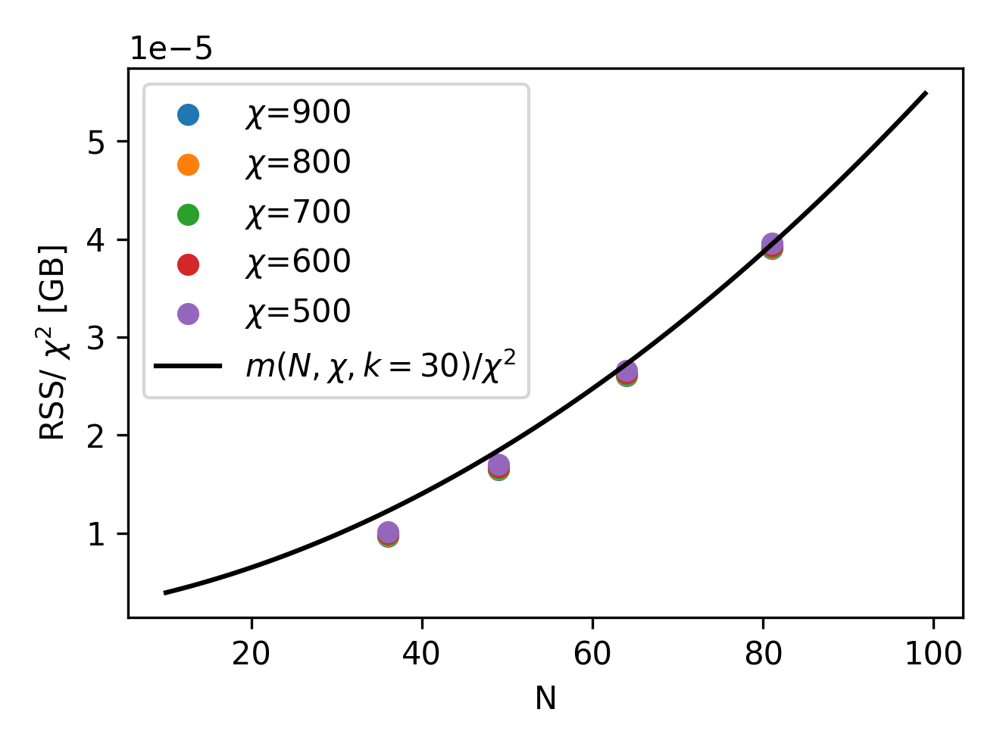
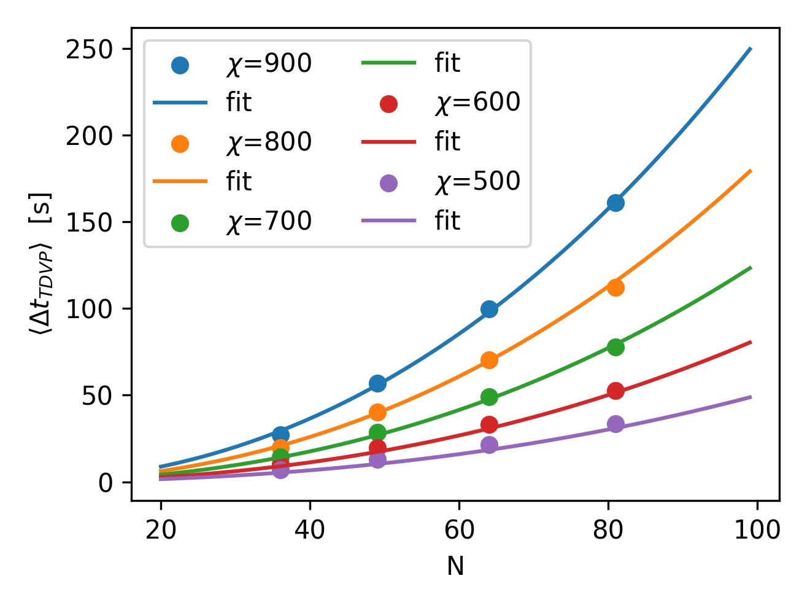

The presence of the `max_bond_dim` and `max_krylov_dim` [config](config.md) parameters means an upper bound on memory consumption and the complexity of the time evolving algorithm can be estimated. By limiting the `max_bond_dim` of a simulation to make it fit in the available hardware memory, it can be guaranteed to run for arbitrary times for an arbitrary number of qubits. Of course, the sources of error described on the [error page](errors.md) imply that limiting the memory consumption of the program will negatively impact the quality of the results once a certain threshold is exceeded. The page in [this link](convergence.md), for example, outlines a case study to determine whether emulation results are accurate.

## Estimating the memory consumption of a simulation

In this section we outline how to estimate the memory consumption of a simulation, for a given `max_bond_dim`, a Krylov subspace of size `max_krylov_dim`, and for $N$ being the number of qubits to be simulated.
There are four contributions to the peak memory consumption of emu-mps that will be discussed in the next sections:

- the state
- the baths
- the Krylov space
- temporary tensors

### Contribution from the state

The quantum state is stored in MPS format ([see here](mps/index.md)). At worst, the bond dimensions of the tensors in an MPS grow exponentially inwards as

$$
2,4,8,16...,16,8,4,2
$$

in which case an MPS will take __more__ memory than a state vector. Let $\chi$ denote the value of `max_bond_dim`.
When $\chi<2^{N/2}$, the bond dimensions in the center all cap at that fixed value of `max_bond_dim`.  Since each tensor in the MPS has 2 bonds of size at most $\chi$, and a physical index of size $p=2$, where each element in the tensor takes $s=16$ bytes (2 8-byte floats to store a complex number), the memory consumption of the state reads

$$
|\psi| < spN\chi^2 = 32N\chi^2
$$

Note that this is a strict over-estimation because the outer bonds in the MPS will be much smaller than $\chi$.

### Contribution from the baths

For TDVP, for each qubit a left and a right bath tensor is stored. The bath tensors are used to compute an effective interaction between the 2-qubit subsystem being evolved, and the rest of the system ([see here](tdvp.md)). Each of them has 3 indices. Two of them will have a size that depends on the state that is evolved, here upper bounded by the maximum allowed value $\chi$ for the bond dimension. For the third, the size $h$ will depend on the interaction type. In concrete, for each qubit, $h$ will be the bond dimension of the [MPO representation](../advanced/hamiltonian.md) of the Hamiltonian.
In summary, for the Rydberg Hamiltonian we expect that $h=2+\text{floor}(n/2)$, and for the XY Hamiltonian that $h=2+2\text{floor}(n/2)$, where in both cases $n=\text{min}(i,N-i)$ for the bath associated with the qubit $i$. The computation is slightly involved, but summing all the contributions leads to a total memory occupation of the baths:

$$
|\mathrm{bath}| < Ns\chi^2h = 4\chi^2N(N+10)
$$

Note that the baths take up more memory than the state, always, and potentially much more. Furthermore, just as for the state this is a strict over-estimation, because it assumes all the bonds in the state are of size $\chi$.

### Contribution from the Krylov space

The remainder of the memory consumption is to compute the time-evolution of qubit pairs in TDVP. This is done by contracting 2 tensors from the MPS together into a single 2-qubit tensor, and time-evolving it by applying an effective Hamiltonian constructed from the baths and the Hamiltonian MPO. Each 2-qubit tensor has a size bounded by $sp^2\chi^2$, so the memory of the Krylov vectors used in the Lanczos algorithm reads

$$
|\mathrm{krylov}| \leq ksp^2\chi^2 = 64k\chi^2
$$

where $k$ is the value of `max_krylov_dim`. Recall that the default value of $k=100$ and if the Lanczos algorithm requires more Krylov vectors to converge to the tolerance, it will error, rather than exceed the above bound.

### Contribution from temporary tensors

Finally, to compute the above Krylov vectors, the effective two-site Hamiltonian has to be applied to the previous Krylov vector to obtain the next one. The resulting tensor network contraction cannot be done in-place, so it has to store two intermediate results that get very large. The intermediate results take the most memory at the center qubit, where the bond dimension of the Hamiltonian becomes $h$, where

$$
|\mathrm{intermediate}| = 2*shp^2\chi^2 = 128h\chi^2
$$

It should be noted that the value of $h$ cited above assumes that all qubits in the system interact via a two-body term, which is technically true for the Rydberg interaction.

### Benchmarking memory footprint

Putting all of this together, for the total memory consumption $m$ of the program, we can write the following bound:

$$
 m(N,\chi,k) = |\psi| + |\mathrm{bath}| + |\mathrm{krylov}| + |\mathrm{intermediate}| < 32N\chi^2 + 4\chi^2N(N+10) + 64*k*\chi^2 + 64(N+4)\chi^2 = 4\chi^2[N(N+34) + 16k + 64]
$$

Note that this estimate is **pessimistic**, since not all $k$ Krylov vectors are likely to be needed, and not all tensors in $\psi$ and the baths have the maximum bond dimension $d$. On the other hand, the estimate for $|intermediate|$ is likely to be accurate, since the bond dimension of $\chi$ is probably attained at the center qubit.

To test the accuracy of the above memory estimations, we run the TDVP time evolution algorithm, fixing the bond dimension to a particular desired value.
For different combinations of the number of atoms in a register $N$ and the fixed bond dimension $chi$, we collect the maximum resident size, or RSS, which is expected to capture the maximum memory needed to run the emulation. We plot the RSS in the following picture (left), as a function of the number of qubits and for different bond dimensions. Notice that, once the RSS is normalized by $\chi^2$, as suggested by our estimate above, all the points fall into the same functional dependency on the number of atoms. Moreover, as we plot the normalized function $m(N,\chi,k)/\chi^2$, for a reasonable estimate of the size of the Krylov subspace ($k=30$), it is clear that our upper bound on memory occupation can be reasonably trusted on a wide range of qubit number and bond dimensions.

Finally, having established an estimate for the memory consumption, it makes sense to explore what are the available regimes of qubits/bond dimension can be reached for a given hardware capability.
Since all heavy simulations will be run on an NVIDIA A100 (on Pasqal's DGX cluster), we have 40 GB of available memory.
Therefore, above, we show (right image) the contour lines of the RSS estimate $m(N,\chi,k=30) < 40$ GB for particular useful values of the total memory, allowing to quickly estimate the memory footprint of an emu-mps emulation.

### An example

For example, the results from the [case study](convergence.md) were obtained using $N=49$ and $d=1600$ on 2 GPUs. Taking the above formula, and halving the contributions from $\psi$ and $|\mathrm{bath}|$ since they are split evenly on the GPUs, we reproduce the memory consumption of the program for $k=13$. Notice that the actual number of Krylov vectors required to reach convergence is likely closer to around $30$, but here we underestimate it, since the contributions of $\psi$ and $|\mathrm{bath}|$ are over-estimated.

## Estimating the runtime of a simulation

Similarly to the previous section, here, we briefly estimate the complexity of the two-site TDVP algorithm we use to time evolve the state in a single pulse sequence step.
As before, the two relevant computational steps are

- Computing the baths
- Applying the effective Hamiltonian

In both cases, it will boil down to an exercise in complexity estimation of tensor network contractions. For simplicity, as before, we will restrict to the worst case scenario in which the bond dimension $\chi$ always take the maximum allowed value.
Importantly, another significant contribution to the runtime can come from computing complex observables like two-point correlation functions, which is not included here.

### Contribution from the baths

Roughly, baths computation involves the represented tensor network contraction:

Each of these tensor multiplication takes respectively $O(ph\chi^3)$, $O(p^2h^2\chi^2)$, and $O(ph\chi^3)$. In an all-to-all Rydberg interaction, we already argued that the bond dimension of the Hamiltonian MPO should scale as the number of atoms. Moreover, the left and right baths need to be computed roughly N times, thus the overall expected complexity is $O(N^2\chi^3) + O(N^3\chi^2)$.

### Contribution from the effective Hamiltonian

Applying the effective two-body Hamiltonian is slightly a more involved tensor network contraction:

In steps, it is composed by applying:

- the left bath: $O(p^2h\chi^3)$
- a two-body term coming form the MPO Hamiltonian: $O(p^4h^2\chi^2)$
- the right bath: $O(p^2h\chi^3)$

As before, for an all-to-all Rydberg interaction we expect $h\sim N$. Moreover, the effective Hamiltonian application needs to be done $k$ times, to build the appropriate Krylov subspace, and for every pair.
Finally, to complete the time evolution and bring back the tensors of the state into an MPS form, a final singular value decomposition is required.
For every pair, this requires $O(N\chi^3)$ to be done.
Overall, the expected complexity is thus $O(kN^2\chi^3) + O(kN^3\chi^2) + O(N\chi^3)$.

### Benchmarking runtime
From the previous complexity estimations, we thus expect the complexity of the two-sites TDVP algorithm to have two main contributions

$$\Delta t_{\text{TDVP}}(N,\chi,k)\sim \alpha N^2\chi^3 + \beta N^3\chi^2$$

To check such estimation, as before, we run TDVP multiple times, measuring the average runtime to perform a step.
Below, we show the obtained results for different number of atoms in a register $N$ at fixed bond dimension $\chi$ (left), and at different fixed $N$ but increasing the bond dimension (left). On top of these data points, we also plot the resulting fit of the complexity estimation presented in the equation above. Remarkably, with just two parameters $\alpha$ and $\beta$ with get good agreement.

To wrap up, and to provide an useful tool for runtime estimation for emu-mps, the time to perform a **single**  time step in a sequence can be conveniently visualized (below) for both $N$ and $\chi$ on contour lines.

Superimposing the 40 GB hardware constrain derived in the previous section, it is easy to see that in worst-case scenario, a TDVP step will take roughly 250 seconds to be computed.
