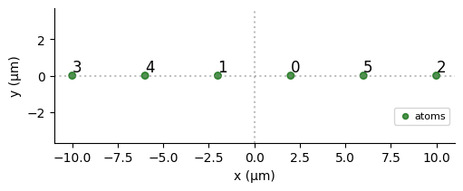
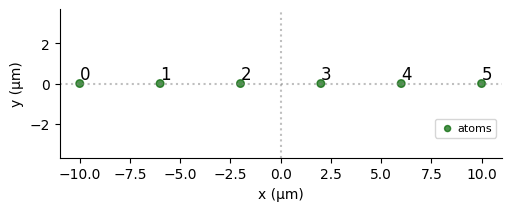
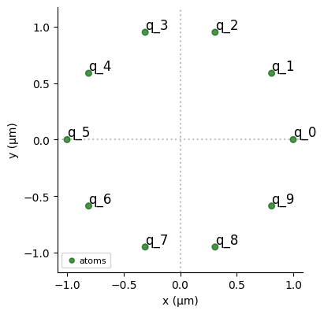
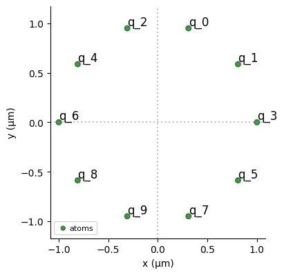
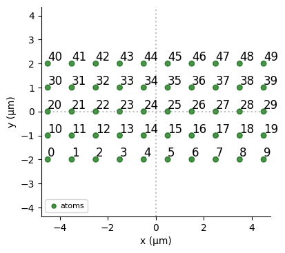
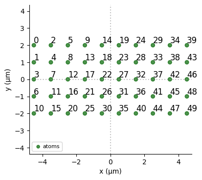
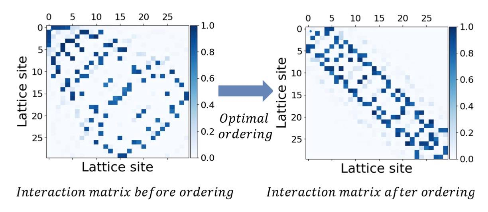

  

  # OptiMatrix
  

OptiMatrix is a Python package designed to improve emu-mps simulations in terms of memory and therefore performance.
It achieves this by improving qubit ordering, arranging them to closely resemble a 1D system. This approach ensures that the system is represented as a 1D structure with minimal long-range interactions.

Effectively, it reduces the bandwidth of an interaction matrix $A_{ij}$ in the Hamiltonian
$$
H = \sum A_{ij} n^z_i n^z_j + ...,
$$
which perfectly fits to the description of the Rydberg or Ising-like systems.

Methods used in the package are based on the Cuthill-McKee algorithm and can be further improved with integer linear programming techniques, see
[arxiv paper](https://arxiv.org/abs/2404.15165).

## Examples

 - 1D open chain. Randomly shuffled qubits got sorted.\
 Before $\to$ after.

  
  

 - 1D periodic chain. Periodic 1D nearest neighbor interacting chain transforms into *open* chain with next nearest neighbor interactions.\
 Before $\to$ after

  
  

 - 2D system. The classical zig-zag line is optimised such that the long interactions in quasi 1D are shorter.\
 Before $\to$ after

  
  

The interaction matrix $A_{ij}$ in the Hamiltonian $$ H = \sum A_{ij} n^z_i n^z_j $$ transforms as:

  

